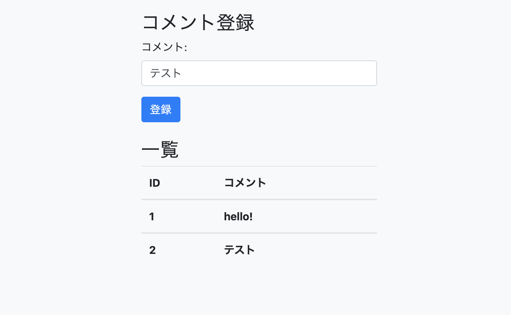

# spring-study2

### boot-mvc-e2

### boot-jpa
- データベース接続練習

### boot-jpa-3
- データベース使用　登録機能
- Spring Boot DevTools(開発ツール)
- Lombok(開発ツール)
- 検証(I/O)
- Spring Data JPA(SQL)
- H2 Database(SQL)
- Thymeleaf(テンプレートエンジン)
- Spring Web(Web)
- Java -version 14
- spring boot 2.3

